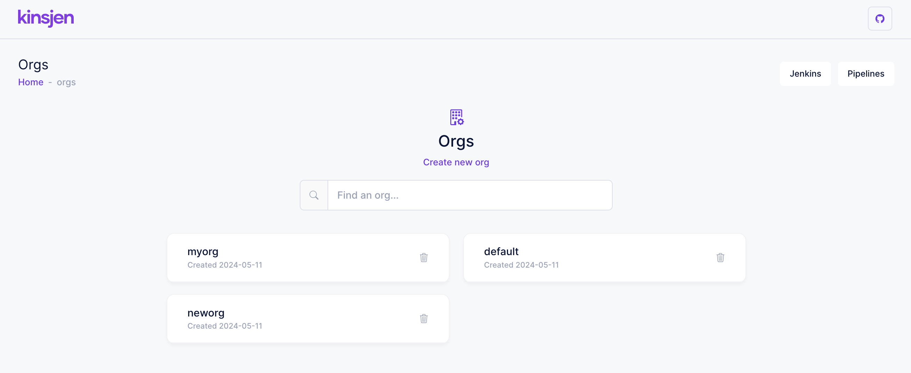
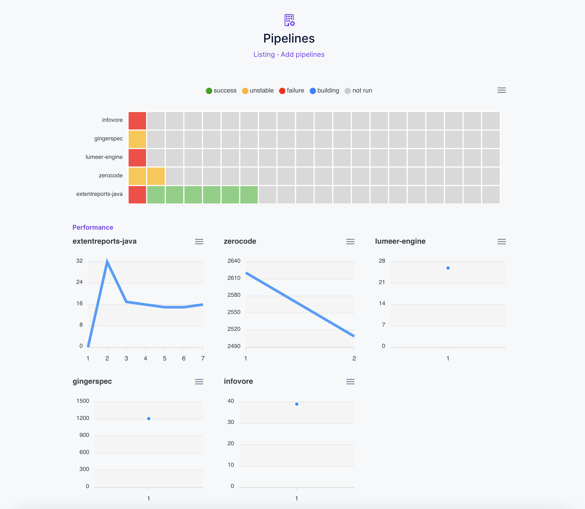
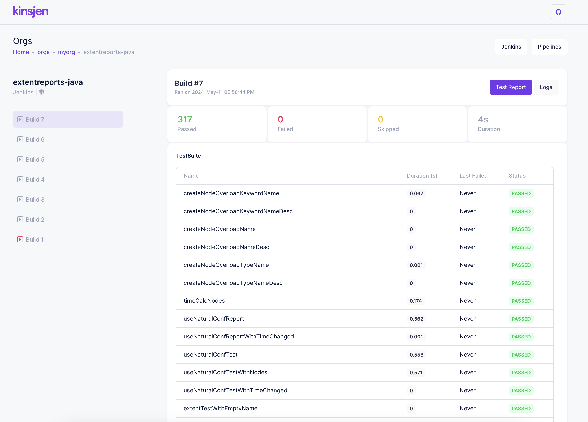

## kinsjen

A small wrapper providing graphical build information and metrics for your Jenkins jobs.

(kins)(jen) -> (jen)(kins)

### Running with the build script

```
$ ./build.sh
```

App will start on port:80. 

Note: the build script currently uses H2 as the default database (but can be changed to either mysql or postgres manually).

### Running the app with sources

```
# backend with h2 database
$ cd server/kinsjen
$ mvn clean install
$ java -jar target/kinsjen.jar -Dspring.profiles.active=h2

# frontend
$ cd client/kinsjen
$ npm install
$ npm start
```

App will start on port:4200.

Alternatively, you can use MySql or Postgres, by specifying the profile:

```
# mysql
$ java -jar kinsjen.jar -Dspring.profiles.active=mysql

# postgres
$ java -jar kinsjen.jar -Dspring.profiles.active=postgres
```

### Setup

After starting the app, visit `/start` and:

1. Create an org - this is where all of your pipelines can be grouped (create as many orgs as required)
2. Connect to your Jenkins instance
3. Start adding pipelines

### Screenshots

##### Orgs


##### Pipelines


##### Metrics


##### Build Details


