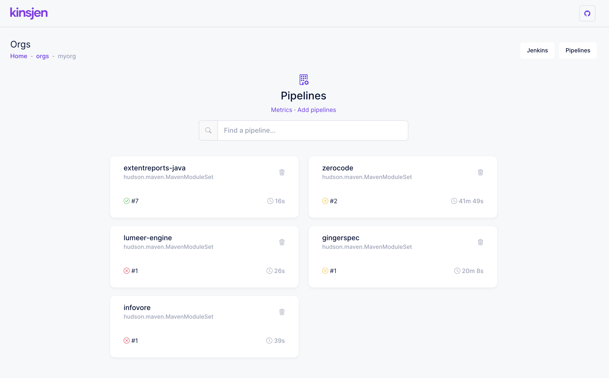

# kinsjen

A small wrapper providing graphical build information and metrics for your Jenkins jobs.

(kins)(jen) -> (jen)(kins)

kinsjen will pull live information from one or more connected Jenkins instances and build metrics for you. It will also show build logs along with `testReport` details (if available).

### Running kinsjen from Docker-Compose

Docker image is available at: https://hub.docker.com/r/anshooarora/kinsjen. 

The recommended way to run `kinsjen` is with `docker-compose`. Currently, the supported databases are:

 - H2 (default)
 - MySQL
 - PostgreSQL

For each database, there is a separate docker-compose.yml available at https://github.com/anshooarora/kinsjen/docker.  

```
# with mysql
docker-compose -f docker-compose-mysql.yml up

# with posgres
docker-compose -f docker-compose-postgres.yml up
```

### Running the app with sources

```
# backend with h2 database
$ cd server/kinsjen
$ mvn clean install
$ java -jar target/kinsjen.jar -Dspring.profiles.active=h2

# frontend
$ cd client/kinsjen
$ npm install
$ npm start
```

App will start on port:4200.

Alternatively, you can use MySql or Postgres, by specifying the profile:

```
# mysql
$ java -jar kinsjen.jar -Dspring.profiles.active=mysql

# postgres
$ java -jar kinsjen.jar -Dspring.profiles.active=postgres
```

### Setup

After starting the app, visit `/start` and:

1. Create an org - this is where all of your pipelines can be grouped (create as many orgs as required)
2. Connect to your Jenkins instance
3. Start adding pipelines

### Screenshots

##### Orgs


##### Pipelines


##### Metrics


##### Build Details


